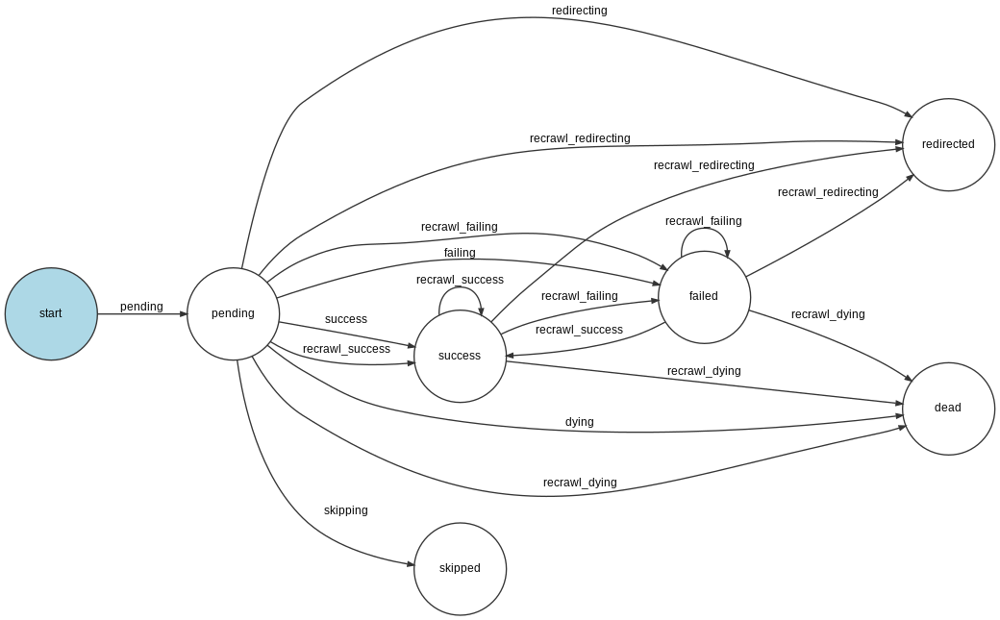

# Symfony web-crawler

## Description
Crawl all links from given url

## Command

```
$ bin/console app:crawl https://symfony.com
```

## Workflow
```
$ bin/console workflow:dump link_crawling | dot -Tpng -o workflow.png
```

